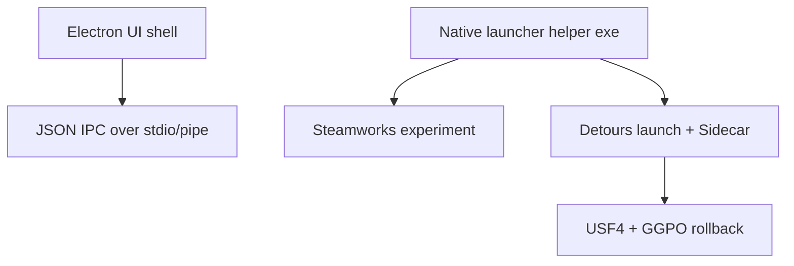

# Electron migration notes

**Status (Steam P2P experiment branch):** The experiment now ships a **Qt Widgets** UI inside `Launcher.exe`. Electron and WebView2 are not required for this branch. Use `.\scripts\package-steam-qt.ps1` and see [STEAM_P2P_EXPERIMENT.md](STEAM_P2P_EXPERIMENT.md).

---

This document captures historical notes on WebView2/Electron shells and what they would have required.

## Current branch choice

The Steam P2P experiment supports **two UI shells**:

| Shell | How to run |
|-------|------------|
| **Electron** (recommended for UI work) | `electron-launcher/README.md` → `npm start` |
| **WebView2** (legacy) | `Launcher.exe` next to `launcher-ui/` |

Both use the same `launcher-ui/` assets and talk to native code via the same `NetplayLaunchController` message protocol. Electron uses `Launcher.exe --electron-ipc` (JSON lines on stdin/stdout).

Native responsibilities unchanged: Steamworks, Detours, Sidecar, game launch.

## What friend search does today

Friend search is implemented entirely in the WebView UI:

- native code still fetches the full friend list via `steamRefreshFriends`
- [launcher-ui/app.js](../launcher-ui/app.js) filters by name, SteamID64, and `only USF4`
- no extra Steamworks calls are needed for search

This is the fastest path and fits the current diagnostic scope.

## Why Electron is attractive

Potential benefits:

- bundled Chromium instead of requiring a separate WebView2 Runtime install
- faster UI iteration with hot reload during experiment work
- easier layout work for friend search, logs, invite flow, and future rollback diagnostics
- better cross-platform UI consistency if the shell is mostly HTML/CSS/JS

Potential costs:

- much larger install size (Chromium bundle vs small WebView2 loader + HTML assets)
- more complex packaging and auto-update story
- still does not remove the need for native Windows code for Detours injection and Sidecar launch

## What cannot move to Electron alone

These responsibilities should stay native even in an Electron future:

| Responsibility | Why native is still needed |
|----------------|-----------------------------|
| Launch USF4 with Detours + `Sidecar.dll` | process injection and game payload |
| Steamworks / Steam P2P | Steam API and socket transport |
| Package validation / updater | file integrity and install replacement |
| Build hash / sidecar hash checks | must match real binaries beside launcher |

## Recommended future architecture

If Electron is pursued later, use a split design:

Suggested phases:

1. **Phase A:** keep current C++ Steam experiment + WebView2 UI (current branch)
2. **Phase B:** move only the experiment UI to Electron, still calling the same native helper
3. **Phase C:** only after Steam P2P proves rollback over Steam transport, consider wider UI migration

## Compile-time impact

Electron does **not** automatically fix the current long native rebuild times.

What it can improve:

- UI-only changes without rebuilding C++
- faster iteration on layout and friend-search UX

What it does **not** remove:

- rebuilding `Sidecar.dll`, `sf4e`, `Session`, Detours-linked targets when those change

A practical hybrid for faster iteration:

- Electron for UI
- native helper built only when transport/game code changes
- optional prebuilt helper binary shipped beside the Electron app

## Recommendation for this repo right now

1. Finish Steam P2P viability in the current native experiment UI.
2. Add friend search and usability improvements in WebView2 first.
3. Revisit Electron only if the team wants a productized shell after Steam rollback transport is proven.

Until rollback works over Steam transport, Electron should be treated as a UI-shell experiment, not as the main netplay path.
