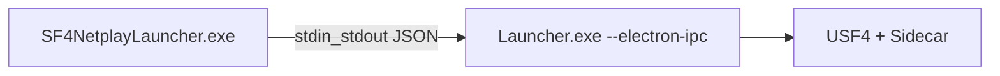

# SF4e Electron launcher

Windows **SF4NetplayLauncher.exe** — Chromium UI that drives native `Launcher.exe --electron-ipc`.

## Build the .exe

From repo root (PowerShell):

```powershell
.\scripts\build-electron-launcher.ps1
```

Or manually:

```powershell
cd electron-launcher
npm install
npm run pack
```

Output:

- `electron-launcher/dist/SF4NetplayLauncher-0.1.0.exe` — single portable executable
- `electron-launcher/dist/win-unpacked/SF4NetplayLauncher.exe` — unpacked folder (faster restarts during dev)

`npm run pack:dir` builds only the unpacked folder (no portable wrapper).

## Full install folder (Electron + native netplay)

Build native Steam launcher first, then bundle:

```powershell
cmake --build msvc-build/steam-p2p --target Launcher Sidecar -j 8
.\scripts\build-electron-launcher.ps1 -NativeDir "msvc-build\steam-p2p"
```

This creates `electron-launcher/dist/sf4e-electron-package/` with:

| File | Role |
|------|------|
| **SF4NetplayLauncher.exe** | UI entry (double-click this) |
| Launcher.exe | Native backend (Steam, game launch) |
| Sidecar.dll, steam_api.dll, … | Same as WebView2 zip |
| launcher-ui/ | Optional; UI is also embedded in the .exe |

**Important:** Keep `Launcher.exe` and DLLs in the **same folder** as `SF4NetplayLauncher.exe`.

## Dev mode (no pack)

```powershell
cd electron-launcher
npm install
npm start
```

Set `SF4E_LAUNCHER_EXE` if native `Launcher.exe` is not in the default build path.

## Architecture



WebView2 fallback: run `Launcher.exe` directly (no Electron).
